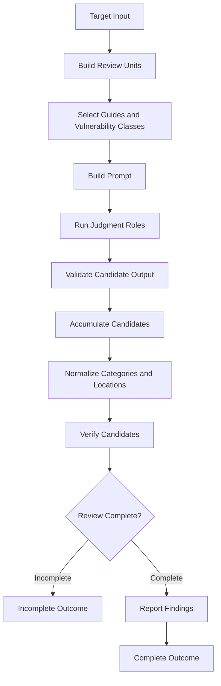
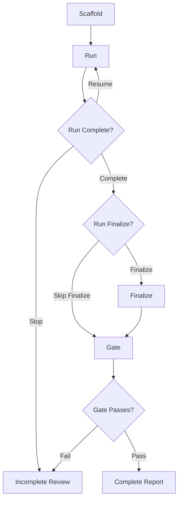
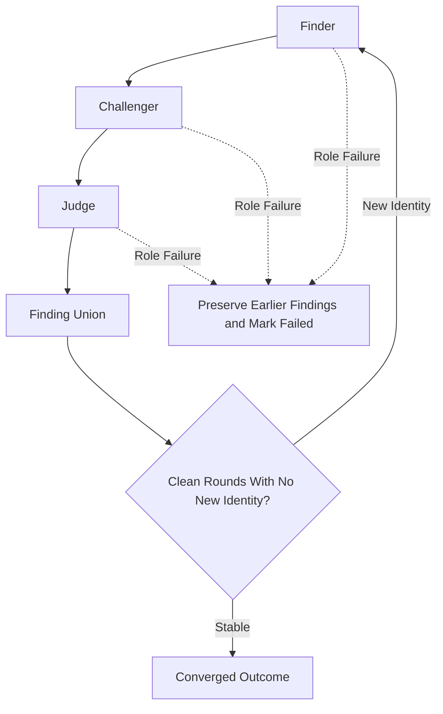

# Engine Design

This document defines the shared review engine, its invariants, and the boundary between
deterministic orchestration and model judgment across Diff Review and Repository Review.
Use [Knowledge Design](knowledge-design.md) for the security knowledge model and
[Knowledge Change Checklist](knowledge-change-checklist.md) for acceptance checks on
knowledge changes. Use `README.md` for installation, CLI commands,
provider configuration, and user workflow.

## Core Terms

| Term | Meaning |
| --- | --- |
| Review unit | A bounded slice of target evidence assigned to the review engine. |
| Facts | Deterministic call, import, storage, or related structure extracted from the target. |
| Knowledge pack | A bounded group of complete vulnerability classes assigned to one judgment. |
| Profile | The selected profile content tree and facts backend used for a review path. |
| Role contract | The Finder, Challenger, or Judge task and required JSON shape assigned to a judgment. |
| Judgment | One model task over a review unit, role contract, and optional knowledge pack. |
| Candidate | A potential issue retained in the working set before final reporting. |
| Finding | A reportable candidate that satisfies location, evidence, and verification requirements. |
| Provenance | The roles, units, and evidence that produced or changed a candidate. |
| Convergence | The configured clean round condition where no new candidate identity appears. |
| Degraded | The `ReviewOutcome.degraded` signal for any incomplete outcome. |
| Gate | The Repository Review check that refuses incomplete workspace state. |
| SARIF | A machine readable finding report in Static Analysis Results Interchange Format. |

The `degraded` signal is not a separate lifecycle state. It marks an incomplete outcome,
including failed work, pending investigation, incomplete verification, or missing convergence.

## Core Invariants

### Generic Orchestration

The engine owns review mechanics, not security expertise. It schedules roles, validates
responses, tracks provenance, accumulates findings, handles failures, runs verification, and
decides whether a review is complete. Profile knowledge, prompts, detection signals, and
target specific location rules remain data or adapter responsibilities.

### Recall-Preserving State

The engine treats recall as the first red line. A later stage may remove a candidate only on
a controlling fact it can read from the target or grounded evidence. Relevance ordering changes
reading order, never inclusion. Accumulation is monotonic across judgment units and adversarial
rounds, so a later omission does not erase an earlier candidate.

### Fail Loud

A failed, rate-limited, blank, malformed, or unparsable model call is incomplete work, not zero
findings. The engine preserves candidates produced before a later role fails, records the failure,
and prevents the outcome from being reported as complete. Pending investigation and incomplete
verification also prevent completion.

## Review Paths

Both paths use the shared engine and verification contract. Each adapter shapes its target and
owns its lifecycle.

| Boundary | Diff Review | Repository Review |
| --- | --- | --- |
| Target | Unified patch | Source tree plus facts |
| Unit | Diff batch with grounding | Source unit with facts |
| Location | Changed lines only | Reviewed source |
| State | Command outcome | Workspace state |
| Lifecycle | Review command | Scaffold, run, finalize, and gate |
| Verification | Source root required | Workspace root required |
| Proof of concept | Not generated | Profile proof of concept support |

Repository units include candidate files, focused fact units, import closure units, and related
source. Diff units include patch local grounding by default and facts backed grounding when a
source root is available.

The paths differ in target shaping and lifecycle. They share role contracts, accumulation rules,
failure accounting, convergence policy, and verification rules that favor recall.

## Shared Workflow

Both paths follow this sequence:

## Diff Review Workflow

Diff Review is the single invocation path for a unified patch. Its adapter:

1. Parses the patch into bounded diff batches.
2. Builds grounding for the batch. Without a source root, the grounding is extracted only from
   patch visible definitions and calls. With a source root, the selected profile facts backend
   adds repository facts for changed files and their relationships.
3. Selects language and framework guides from the changed paths, then selects vulnerability
   classes from the patch and grounding.
4. Runs one Finder judgment for every bounded knowledge pack in standard mode. A pack failure
   preserves successful sibling findings but marks the review incomplete.
5. Runs Finder, Challenger, and Judge rounds in adversarial mode. The round union is carried
   into the next pass until clean convergence or an explicit incomplete outcome.
6. Normalizes finding categories and maps report locations to valid changed lines. A finding
   without a reportable changed location is not emitted as a diff finding.
7. Applies the shared verification contract when a source root or another configured verifier is
   available, then renders text, markdown, JSON, or SARIF output from the same finding state.

Diff Review does not own a persistent scaffold or unit worklist. It returns the outcome from
the command invocation while preserving the same provenance, failure, pending work, and
completion semantics as Repository Review.

## Repository Review Workflow

Repository Review owns a persistent workspace because its lifecycle spans multiple commands:

The stages have distinct responsibilities:

- **Scaffold** detects the stack, extracts facts, writes methodology and knowledge artifacts,
  and creates the unit worklist.
- **Run** reviews open units, resumes from the persisted union when requested, records failures
  and timing, verifies findings, and writes run status.
- **Finalize** parses and canonicalizes candidates, deduplicates them, verifies remaining
  findings, reconciles proofs of concept, and writes confirmed reports.
- **Gate** checks coverage, unit ownership, run completeness, verification state, and calibrated
  candidate state before allowing the review to be reported complete.

The run stage already writes confirmed findings. Finalize is optional for an engine run and
remains available for candidates already stored in a workspace.

The workspace is provenance and resumability state, not a second source of security knowledge.
Knowledge remains under the selected profile content root.

## Shared Engine Contracts

The shared engine defines review mechanics. Target adapters define unit construction, prompt
shape, finding identity, location rules, and command lifecycle. The contracts below name the owner
modules. The Implementation Map below gives the path index.

| Owner | Responsibility |
| --- | --- |
| Engine | Plans, roles, failures, rounds, convergence, and outcomes |
| Verification | Skeptic and confirmer orchestration |
| Vulnerabilities | Knowledge loading, selection, packing, aliases, and categories |
| Providers | Provider calls, retries, and metering |
| JSON parser | JSON extraction |
| Diff adapters | Diff units, prompts, locations, and command outcome |
| Repository adapters | Workspace, units, run, finalize, and gate lifecycle |

### Adapter Entry Points

The adapters enter the shared engine through a small set of shared contracts:

| Contract | Shared Mechanism | Adapter Provides |
| --- | --- | --- |
| Execution policy | `review_plan` | Mode and limits |
| Standard judgment | `run_standard_judgments` | Unit prompt and Finder adapter |
| Role round | `run_role_round` | Role prompts and response adapters |
| Cycle loop | `run_review_cycles` | Next cycle and identity |
| Unit fan out | `run_review_units` | Unit list, known findings, and ownership records |
| Candidate union | `FindingAccumulator` | Identity and merge rules |
| Outcome state | `ReviewOutcome` | Verification, report, persistence, and gate state |

Both adapters use these contracts. They supply target specific units, prompts, finding identity,
location rules, and lifecycle persistence while the shared engine retains role semantics, failure
accounting, accumulation, and completion rules.

The standard judgment runner, `run_standard_judgments`, keeps successful knowledge packs when a
sibling fails. Role rounds through `run_role_round` keep candidates produced before a later role
failure. Cycle and unit runners, `run_review_cycles` and `run_review_units`, aggregate failures
and pending investigation into the same outcome instead of treating missing work as clean. The
accumulator grows the identity union through `FindingAccumulator`, while `ConvergenceState` decides
whether clean rounds have stabilized it. The `ReviewOutcome.complete` property then requires the
configured completion policy, no failures or pending work, and successful postprocessing by the
target adapter.

## Prompt Construction

Prompts are the boundary between deterministic target evidence, profile security knowledge,
and model judgment. Prompt builders must not replace the knowledge catalog with hardcoded
vulnerability logic.

### Prompt Inputs

Each adapter composes a prompt from these inputs:

| Input | Source | Purpose |
| --- | --- | --- |
| Role contract | Adapter prompt module | Role task and JSON shape |
| Review policy | Selected profile | High confidence standard and do-not-report rules |
| Categories and rubric | Profile catalog | Category names and severity calibration |
| Target evidence | Target adapter | Diff, source unit, context, guides, or facts |
| Knowledge pack | Shared selector | Complete vulnerability class bodies |
| Prior candidates | Engine accumulator | Findings carried between packs or rounds |

The target adapter shapes evidence. Shared prompt helpers own reusable judgment wording and the
prompt plan boundary. A prompt assignment is not evidence of a finding. The model must still
provide a concrete exploit path and an exact location.

### Stable and Variable Content

The shared `PromptPlan` separates a reusable `stable_prefix` from a changing `judgment_suffix`.
The prefix contains the target evidence and policy that should remain identical while bounded
knowledge packs are reviewed. The suffix names the assigned class pack, explains how to treat other
selected classes, and provides the output shape.

Diff Review builds its prefix from focus, do-not-report guidance, allowed categories, selected
stack guides, the numbered patch, grounded context, and the severity rubric. Repository Review
builds its prefix from the mandate, rubric, shared context, extracted facts, allowed
categories, and the source unit. Repository adversarial prompts add the selected knowledge
blocks to the stable evidence before appending the role task.

Providers receive the stable prefix as `cache_prefix` when the adapter enables caching. This
is a provider optimization and must not change the evidence, selected classes, or completion
state. A cache boundary is valid only when the prefix is genuinely reusable for that target.

### Role Output Contracts

The role system separates discovery from skepticism and adjudication:

- The Finder searches broadly for exploitable issues and returns `findings`.
- The Challenger returns `rebuttals` for unsupported candidates and `new_findings` for issues
  the Finder missed. A rebuttal needs a controlling safety fact visible in the reviewed target.
- The Judge evaluates both streams and returns surviving `findings`. It may also return
  downgraded, dismissed, unresolved, or investigate items where the target adapter supports
  those fields.

System prompts require one JSON object with no surrounding prose. The parser requires
the object and required top-level list fields. Target adapters then normalize finding items,
locations, severities, and categories into the target finding type. Unusable top-level output
is a role failure. Item-level noise is filtered during adaptation, but it cannot turn a failed
role call into a clean review.

### Prompt Safety Rules

Prompt changes follow the same invariants as engine and knowledge changes:

- Keep the general case as the objective. Do not add benchmark case names, sink names, answer
  key facts, case variables, or expected fix shapes.
- Preserve recall. Do not tell a role to dismiss a candidate because a control is merely
  assumed or located outside the evidence. Dismissal requires a controlling fact the role can
  read.
- Keep class bodies complete within a pack. Selection controls ordering and assignment, not a
  claim that other real classes are impossible.
- Keep the output contract explicit and parseable. A missing or malformed response is failed
  work and remains visible in the outcome.
- Keep prompt content English only and use profile data for focus, reporting exclusions, guides,
  vulnerability classes, and severity guidance.

## Review Modes

### Standard Mode

Standard mode runs one Finder judgment for each review unit or knowledge pack. Successful
sibling judgments are merged. A failed judgment leaves the review incomplete and cannot erase
findings returned by other siblings.

### Adversarial Mode

Adversarial mode runs Finder, Challenger, and Judge roles in rounds:

- The Finder proposes exploitable findings.
- The Challenger tries to refute findings using controlling facts visible in the target. It also
  searches for missed findings.
- The Judge rules on candidates and can adjust severity or retain a candidate that remains supported.

The review loop unions candidates across rounds. A later omission does not delete an earlier
candidate. Convergence requires the configured number of consecutive clean rounds that add no
new finding identity. Reaching the round cap is not proof of convergence.

The adversarial loop is intentionally recall preserving:

## Finding Accumulation and Identity

Each adapter supplies a finding identity function and an evidence folding function.
The `FindingAccumulator` preserves insertion order, merges repeated identities, and can aggregate
severity votes. Diff identity includes the reported file, line, and category context. Repository
identity can include symbol, endpoint, location, and category context, subject to the profile's
deduplication policy.

Knowledge selection happens per judgment unit. Matching hints affect relevance ordering but every
matching class remains selected. Bounded knowledge packs retain complete class bodies. The same
unit evidence is reused across packs so pack boundaries cannot change selection evidence.

## Verification Contract

Verification favors recall:

- A skeptic tries to prove a candidate safe.
- A candidate is dropped only when every applicable independent confirmer upholds the refutation.
- A verifier that found a candidate cannot also confirm its deletion. The engine tracks that rule
  with `found_by` provenance.
- With no distinct confirmer, the candidate is retained.
- A verifier failure, malformed verdict, or incomplete source check retains the candidate and
  marks the outcome incomplete. Its `degraded` signal becomes true.

This contract applies to both paths. Adapters translate their finding shape and source root into
the shared verification interface.

## Completion and Failure

An outcome is complete only when all required work is accounted for:

- no failed review units or role calls
- no pending investigation work
- no incomplete verification
- no verification or parsing errors
- convergence when the review plan requires it

Standard mode does not require convergence. Adversarial mode does. Diff Review surfaces a
degraded result and exits nonzero when required work fails or does not converge. Repository Review
persists the same state in `_run.json` and the repository gate refuses an incomplete run.

## Extension Boundaries

Adding a language, framework, protocol, or vulnerability class should normally be a profile data
change plus tests. A new profile adds its content root and registry entry. Engine changes are
appropriate only when the generic review contract changes, such as a new lifecycle state,
failure rule, shared role contract, or target neutral verification behavior.

Engine changes must follow [No Benchmark Overfitting](knowledge-design.md#no-benchmark-overfitting)
and the [Knowledge Change Checklist](knowledge-change-checklist.md). Measure behavior changes with
the two arm procedure in `../evals/docs/detection-quality-backtest.md`, section `Comparing Two Configurations`, before making
them the default. Recall decides first. Cost is always recorded but does not reject a change on its
own.

Defaults for pack size, context budgets, review rounds, convergence, concurrency, and verification
live in `cyberjury/review/settings.py`. CLI flags such as `--rounds` override the exposed execution
settings.

## Implementation Map

Paths in this map are relative to the code repository root.

- Shared engine and convergence: `cyberjury/review/engine.py`
- Review settings and defaults: `cyberjury/review/settings.py`
- Knowledge selection and packing: `cyberjury/review/vulnerabilities.py`
- Shared prompt planning: `cyberjury/review/prompts.py`
- Facts contracts, extraction, and failure semantics: `cyberjury/review/facts.py`
- Shared grounding context envelope: `cyberjury/review/context.py`
- Shared verification: `cyberjury/review/verification.py`
- Provider calls, retries, and metering: `cyberjury/providers/`
- JSON parsing: `cyberjury/json_parse.py`
- Diff Review adapters: `cyberjury/review/diff/`
- Repository Review adapters and workspace: `cyberjury/review/repository/`
- Repository Review completion gate: `cyberjury/review/repository/gate.py`
- Profile content and facts backend implementations: `cyberjury/profiles/`
- CLI and report rendering: `cyberjury/cli.py`, `cyberjury/report.py`
- User commands and provider setup: `README.md`
- Backtest procedure: `../evals/docs/detection-quality-backtest.md`
