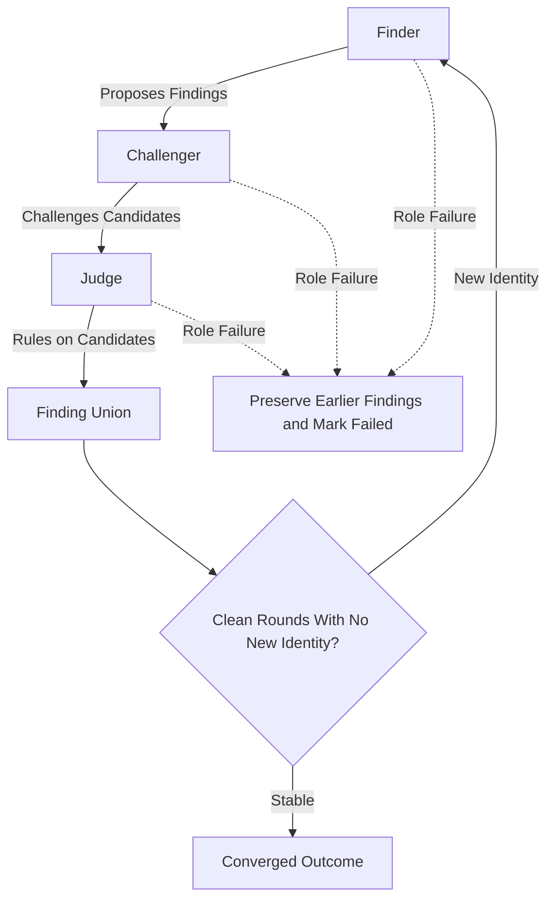
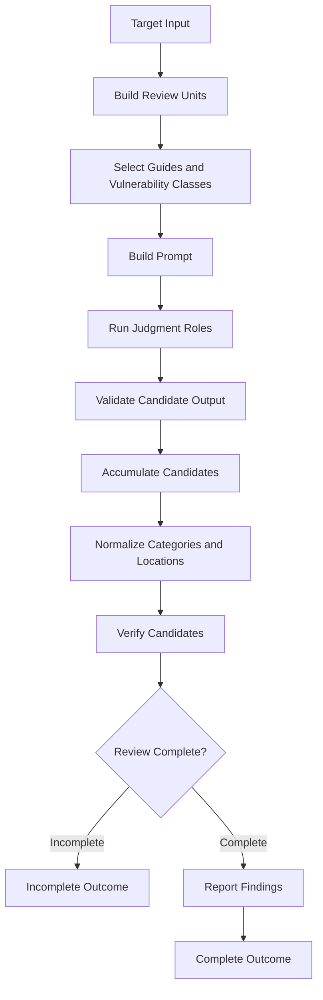
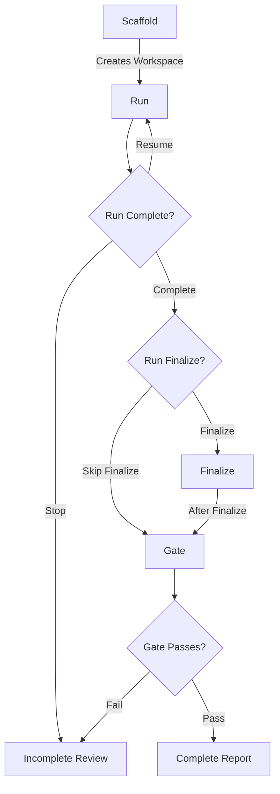

# Engine Design

This document defines the shared review engine, its invariants, and the boundary between
deterministic orchestration and model judgment across Diff Review and Repository Review.
Use [Knowledge Design](knowledge-design.md) for the security knowledge model and
[Knowledge Change Checklist](knowledge-change-checklist.md) for acceptance checks on
knowledge changes. Use `README.md` for installation, CLI commands,
provider configuration, and user workflow.

## Core Terms

| Term | Meaning |
| :--- | :--- |
| Candidate | A potential issue retained in the working set before final reporting. |
| Convergence | The configured clean round condition where no new candidate identity appears. |
| Degraded | The `ReviewOutcome.degraded` signal for any incomplete outcome. |
| Evidence catalog | Exact source fragments a Finder may request by engine issued id. |
| Facts | Deterministic call, import, storage, or related structure extracted from the target. |
| Finding | A reportable candidate that satisfies location, evidence, and verification requirements. |
| Gate | The Repository Review check that refuses incomplete workspace state. |
| Judgment | One model task over a review unit, role contract, and optional knowledge pack. |
| Knowledge pack | A bounded group of complete vulnerability classes assigned to one judgment. |
| Profile | The selected profile content tree and facts backend used for a review path. |
| Provenance | The roles, units, and evidence that produced or changed a candidate. |
| Review unit | One target surface assignment with optional dependency evidence. |
| Role contract | The Finder, Challenger, or Judge task and required JSON shape assigned to a judgment. |
| SARIF | A machine readable finding report in Static Analysis Results Interchange Format. |

The `degraded` signal is not a separate lifecycle state. It marks an incomplete outcome,
including failed work, missing grounding, pending investigation, incomplete verification, or
missing convergence.

## Core Invariants

### Generic Orchestration

The engine owns review mechanics, not security expertise. It schedules roles, validates
responses, tracks provenance, accumulates findings, handles failures, runs verification, and
decides whether a review is complete. Profile knowledge, prompts, detection signals, and
target specific location rules remain data or adapter responsibilities.

### Recall-Preserving State

The engine treats recall as the first red line. A later stage may remove a candidate only on
a controlling fact it can read from the target or grounded evidence. Relevance ordering changes
reading order, never inclusion. Accumulation is monotonic across judgment units and adversarial
rounds, so a later omission does not erase an earlier candidate.

### Fail Loud

A failed, rate-limited, blank, malformed, or unparsable model call is incomplete work, not zero
findings. The engine preserves candidates produced before a later role fails, records the failure,
and prevents the outcome from being reported as complete. Pending investigation and incomplete
verification also prevent completion.

## Review Paths

Both paths use the shared engine and verification contract. Each adapter shapes its target and
owns its lifecycle.

| Boundary | Diff Review | Repository Review |
| :--- | :--- | :--- |
| Target | Unified patch | Source tree plus facts |
| Unit | Changed patch surface with grounding | Candidate source range with facts |
| Location | Post change hunk line plus exact changed anchor | Reviewed source |
| State | Command outcome | Workspace state |
| Lifecycle | Review command | Scaffold, run, finalize, and gate |
| Verification | Source root required | Target and workspace roots required |
| Proof of concept | Not generated | Profile proof of concept support |

Repository units always cover candidate source ranges. Focused facts and dependency subgraphs add
grounding, but never replace that base coverage. Diff units always cover changed lines. They use
patch local grounding by default and repository dependency grounding when a source root is
available.

The paths differ in target shaping and lifecycle. They share role contracts, accumulation rules,
failure accounting, convergence policy, and verification rules that favor recall.

Profile PoC factories implement the shared contracts in `cyberjury/profiles/base.py`. Every backend
can generate and describe an artifact. An automatically executing backend also exposes managed
generation, repair, and execution through the reproduction capability. Web PoCs remain manual and
EVM PoCs may run only through the local Foundry backend.

## Review Modes

### Standard Mode

Standard mode runs one Finder judgment for each review unit and knowledge pack. Both CLI paths
configure one Finder reviewer. The engine merges its candidate state before applying verification
and completion rules.

### Adversarial Mode

Adversarial mode runs Finder, Challenger, and Judge roles in rounds:

- The Finder proposes exploitable findings.
- The Challenger tries to refute findings using controlling facts visible in the target. It also
  searches for missed findings.
- The Judge rules on candidates and can adjust severity or retain a candidate that remains supported.

The review loop merges the finding union after every round. Convergence requires the configured
number of consecutive clean rounds that add no new finding identity. Reaching the round cap is not
proof of convergence.

## Shared Workflow

Both paths follow this sequence:

## Diff Review Workflow

Diff Review is the single invocation path for a unified patch. Its adapter:

1. Parses the patch into changed review surfaces and joins surfaces connected by resolved
   dependency edges. Each connected component remains one review unit. Independent components
   are then packed toward the diff size target.
2. Builds grounding for the batch. Without a source root, the grounding is extracted only from
   patch visible definitions and calls. With a source root, the selected profile facts backend
   adds source evidence from typed dependency subgraphs. An unchanged call inside a changed
   definition remains visible in the graph facts.
3. Requests the diff knowledge inputs defined by
   [Runtime Knowledge Flow](knowledge-design.md#runtime-knowledge-flow).
4. Runs one Finder judgment for every bounded knowledge pack in standard mode.
5. Runs Finder, Challenger, and Judge rounds in adversarial mode. The round union is carried
   into the next pass until clean convergence or the configured round limit.
6. Normalizes finding categories and validates two locations. The report location must be a post
   change line shown in the patch. The change anchor must be an exact old or new changed line. This
   represents added behavior, removed controls, and cross file effects without treating unchanged
   context as a change.
7. Applies the shared verification contract when a source root or another configured verifier is
   available, then renders text, markdown, JSON, or SARIF output from the same finding state.

Diff Review does not own a persistent scaffold or unit worklist. It returns the outcome from
the command invocation while preserving the same provenance, failure, pending work, and
completion semantics as Repository Review.

## Repository Review Workflow

Repository Review owns a persistent workspace because its lifecycle spans multiple commands:

The stages have distinct responsibilities:

- **Scaffold** detects the stack, extracts facts, writes methodology and knowledge artifacts,
  and creates the unit worklist.
- **Run** reviews open units, resumes from the persisted union when requested, records failures
  and timing, verifies findings, and writes run status.
- **Finalize** parses and canonicalizes candidates, deduplicates them, verifies remaining
  findings, reconciles proofs of concept, and writes confirmed reports.
- **Gate** checks coverage, unit ownership, run completeness, verification state, and calibrated
  candidate state before allowing the review to be reported complete.

The run stage already writes confirmed findings. Finalize is optional for an engine run and
remains available for candidates already stored in a workspace.

The repository runner also accepts multiple injected Finder reviewers for programmatic fan out and
rotates them across rounds. The CLI does not configure this Repository Review extension.

The workspace is provenance and resumability state, not a second source of security knowledge.
Knowledge remains under the selected profile content root.
The `.cyberjury/workspace.json` marker binds the resolved target, selected profile, and source
fingerprint, and a changed identity requires `--fresh`.

## Shared Engine Contracts

The shared engine defines review mechanics. Target adapters define unit construction, prompt
shape, finding identity, location rules, and command lifecycle. The table below names each
responsibility owner.

| Owner | Responsibility |
| :--- | :--- |
| Engine | Plans, roles, failures, rounds, convergence, and outcomes |
| Verification | Skeptic and confirmer orchestration |
| Vulnerabilities | Knowledge loading, selection, packing, aliases, and categories |
| Providers | Provider calls, retries, and metering |
| JSON parser | JSON extraction |
| Diff adapters | Diff units, prompts, locations, and command outcome |
| Repository adapters | Workspace, units, run, finalize, and gate lifecycle |

### Adapter Entry Points

The adapters enter the shared engine through a small set of shared contracts:

| Contract | Shared Mechanism | Adapter Provides |
| :--- | :--- | :--- |
| Execution policy | `review_plan` | Mode and limits |
| Unit fan out | `run_review_units` | Unit list, known findings, and ownership records |
| Cycle loop | `run_review_cycles` | Next cycle and identity |
| Standard judgment | `run_standard_judgments` | Unit prompt and Finder adapter |
| Role round | `run_role_round` | Role prompts and response adapters |
| Candidate union | `FindingAccumulator` | Identity and merge rules |
| Outcome state | `ReviewOutcome` | Verification, report, persistence, and gate state |

Both adapters use these contracts. They supply target specific units, prompts, finding identity,
location rules, and lifecycle persistence while the shared engine retains role semantics, failure
accounting, accumulation, and completion rules.

### Facts and Grounding

Facts backends resolve dependency endpoints before the shared engine sees them. Each edge keeps its
kind, source definition when one exists, target source range, and resolution state. The resolution
is either exact or ambiguous. An internal edge that cannot be resolved remains an unresolved
receipt instead of disappearing. A readable source file that the native analyzer cannot parse, or
that exceeds the configured parse size, becomes a structured facts limitation. Other source files
still contribute facts, and the opaque file is reviewed from its raw source, but the review remains
incomplete until that limitation is removed. Incomplete facts are persisted for diagnosis but are
not stored in the reusable facts cache.

A judgment unit receives only the limitations for source it renders, relationships it presents, or
evidence it publishes for a bounded request. An unrelated repository limitation does not change that
unit. The target outcome retains the union of relevant unit limitations so resume, finalize, and the
repository gate cannot report incomplete grounding as complete.

Backend startup, unavailable native tools, invalid analyzer configuration, and repository wide
compilation failures remain hard extraction failures. Missing source bytes or a missing configured
grammar also fail extraction. Recoverable limitations require source that remains available for raw
review. This gives every profile the same contract without pretending that a Tree-sitter parser gap
and a Slither compilation failure have the same recovery scope.

Each profile implements the same facts pipeline. Its analyzer owns the native tool boundary and
normalizes native output into typed local analysis. Its resolver maps analyzed identities to
repository paths, ranges, and dependency endpoints. Its graph module builds and renders the shared
facts shape. Its backend coordinates those stages and owns the public extraction contract. This
keeps Web and EVM structurally aligned without pretending that Tree-sitter queries and Slither
compilation are the same operation.

The EVM analyzer preserves exact Slither call endpoint identity in typed analyzed calls. Its
resolver maps those identities to repository definition fragments. The Web backend resolves
Tree-sitter calls, named and default imports, and namespace qualified references within the
repository import scope. Lexical owner identity keeps `self` and `this` calls inside their owning
type, including closures that preserve the receiver. A nested function that rebinds `this` does not
inherit the class owner. An unqualified call resolves within its configured call scope or through a
symbol imported into the file. Python, JavaScript, and TypeScript expose top level definitions in
file scope and preserve enclosing function scopes for nested definitions. A class member does not
become a bare file binding. Go package functions also resolve across files in the same package
scope. That scope combines the source directory and parsed package declaration rather than matching
a repository wide name. Re-export traversal follows the same symbol through every reachable facade
module and stops at cycles. A member call with no resolvable namespace does not fan out to every
repository method with the same name. A first party import that resolves to source but not a
definition remains an unresolved receipt. When syntax leaves more than one scoped target possible,
the backend retains every candidate and marks the edges ambiguous.

The shared subgraph builder never resolves a target from a bare function name. Diff Review starts from
definitions that contain changed lines. Repository Review starts from definitions in each candidate
file. Traversal continues from the reached definition, not from every function in the reached file.
This keeps unrelated sibling functions out of an attack path.

The planner preserves a directed dependency subgraph instead of flattening relationships into an
unordered set of definitions or enumerating every combinatorial path. Each direct caller of a changed
or candidate definition starts a review surface that keeps the caller and callee together. Existing
outbound traversal from the reviewed definition keeps its configured depth. Full source evidence is
selected by hop within a soft packing target. Final rendering never truncates selected evidence after
recording it as included.
For Diff Review, changed surfaces joined by a resolved dependency edge form one atomic component
before packing. A soft size target may group independent components, but it never splits a known
path between changed entrypoint and changed sink code.

The dependency graph is an internal navigation index, not a block copied wholesale into the
prompt. Targets omitted from the initial source window become an evidence catalog. Each catalog
entry has an opaque stable id, an exact source identity, and a short relationship label. The model
also sees the exact declaration signature, which exposes compact type and inheritance structure
without copying the implementation body. It can select from those ids but cannot ask the engine
to browse an arbitrary path or symbol.

A Finder may request published evidence once. The context layer materializes the published catalog.
The engine validates every id, enforces the request budget, selects the exact source fragment, and
runs one follow up judgment with that source. Findings from the first reply remain in the monotonic
union. An unknown id, an over budget request, a failed follow up, or another request after the
follow up marks the judgment incomplete. Diff Review and
Repository Review use this same exchange in standard and adversarial mode. In adversarial mode,
the Challenger and Judge receive the source selected by the Finder.

Target coverage and grounding coverage are separate. Target coverage accounts for every changed
line or candidate source range. Grounding coverage accounts for source fragments promised to one
judgment and source returned for an evidence request. A dependency edge is not proof that its
target source was read, so the edge alone never counts as included evidence. Dependency grounding
supplements Repository Review source units and never turns the presence of one parsed definition
into coverage of the whole file.

The composition layers apply the core invariants at different scopes.
`run_standard_judgments` owns knowledge packs, `run_role_round` owns one role sequence,
`run_review_cycles` owns convergence, and `run_review_units` owns target coverage.
`FindingAccumulator`, `ConvergenceState`, and `ReviewOutcome` carry their combined state into the
completion policy.

## Prompt Construction

Prompts are the boundary between deterministic target evidence, profile security knowledge,
and model judgment. Prompt builders must not replace the knowledge catalog with hardcoded
vulnerability logic.

### Prompt Inputs

Each adapter composes a prompt from these inputs:

| Input | Source | Purpose |
| :--- | :--- | :--- |
| Role contract | Adapter prompt module | Role task and JSON shape |
| Review policy | Selected profile | High confidence standard and do-not-report rules |
| Categories and rubric | Profile catalog | Category names and severity calibration |
| Target evidence | Target adapter | Diff, source unit, context, guides, or facts |
| Evidence catalog | Shared grounding context | Exact dependency source available by id |
| Knowledge pack | Shared selector | Complete vulnerability class bodies |
| Prior candidates | Engine accumulator | Findings carried between packs or rounds |

The target adapter shapes evidence. Shared prompt helpers own reusable judgment wording and the
prompt plan boundary. A prompt assignment is not evidence of a finding. The model must still
provide a concrete exploit path and an exact location.

### Stable and Variable Content

The shared `PromptPlan` separates a reusable `stable_prefix` from a changing `judgment_suffix`.
The prefix contains the target evidence and policy that should remain identical while bounded
knowledge packs are reviewed. The suffix names the assigned class pack, explains how to treat other
selected classes, and provides the output shape.

Diff Review builds its prefix from focus, do-not-report guidance, allowed categories, selected
stack guides, the patch with `old:new` line gutters, grounded context, and the severity rubric.
Repository Review builds its prefix from the mandate, rubric, shared context, extracted facts,
allowed categories, and the source unit. Repository adversarial prompts add the selected
knowledge blocks to the stable evidence before appending the role task.

Providers receive the stable prefix as `cache_prefix` when the adapter enables caching. This
is a provider optimization and must not change the evidence, selected classes, or completion
state. A cache boundary is valid only when the prefix is genuinely reusable for that target.

### Role Output Contracts

The role system separates discovery from skepticism and adjudication:

- The Finder searches broadly for exploitable issues and returns `findings`. It may also return
  `evidence_requests` containing only ids published in the prompt.
- The Challenger returns `rebuttals` for unsupported candidates and `new_findings` for issues
  the Finder missed. A rebuttal needs a controlling safety fact visible in the reviewed target.
- The Judge evaluates both streams and returns surviving `findings`. It may also return
  downgraded, dismissed, unresolved, or investigate items where the target adapter supports
  those fields.

System prompts require one JSON object with no surrounding prose. The parser requires
the object and required top-level list fields. Target adapters then normalize finding items,
locations, severities, and categories into the target finding type. Unusable top-level output
is a role failure. Item-level noise is filtered during adaptation, but it cannot turn a failed
role call into a clean review.

### Prompt Constraints

Prompt changes preserve [Core Invariants](#core-invariants) and keep the general case as the
objective. Prompt builders use profile data for security focus, reporting exclusions, guides,
vulnerability classes, and severity guidance. They keep model-facing content English and require
an explicit JSON output contract. Knowledge completeness and benchmark integrity are defined in
[Knowledge Design](knowledge-design.md#design-principles).

## Finding Accumulation and Identity

Each adapter supplies a finding identity function and an evidence folding function.
The `FindingAccumulator` preserves insertion order, merges repeated identities, and can aggregate
severity votes. Diff identity includes the reported file, line, category, description, and
effective change anchor, so an invalid anchor cannot replace a valid candidate before location
checks run. Repository identity can include symbol, endpoint, location, and category context,
subject to the profile's deduplication policy.

Knowledge selection and pack completeness follow
[Runtime Knowledge Flow](knowledge-design.md#runtime-knowledge-flow). The engine reuses the same
unit evidence for every pack in that plan.

## Verification Contract

Verification favors recall:

- A skeptic tries to prove a candidate safe.
- A candidate is dropped only when every applicable independent confirmer upholds the refutation.
- A verifier that found a candidate cannot also confirm its deletion. The engine tracks that rule
  with `found_by` provenance.
- With no distinct confirmer, the candidate is retained.
- A verifier failure, malformed verdict, or incomplete source check retains the candidate and
  marks the outcome incomplete. Its `degraded` signal becomes true.

This contract applies to both paths. Adapters translate their finding shape and source root into
the shared verification interface.

## Completion and Failure

An outcome is complete only when all required work is accounted for:

- no failed review units or role calls
- no uncovered changed lines or candidate source ranges
- no pending investigation work
- no missing or unresolved required grounding evidence
- no incomplete verification
- no verification or parsing errors
- convergence when the review plan requires it

Standard mode does not require convergence. Adversarial mode does. Diff Review surfaces a
degraded result and exits nonzero when required work fails or does not converge. Repository Review
persists the same state in `_run.json` and the repository gate refuses an incomplete run.

## Extension Boundaries

Adding a language, framework, protocol, or vulnerability class should normally be a profile data
change plus tests. A new profile adds its content root and registry entry. Engine changes are
appropriate only when the generic review contract changes, such as a new lifecycle state,
failure rule, shared role contract, or target neutral verification behavior.

The [Knowledge Change Checklist](knowledge-change-checklist.md) applies only to profile content.
Engine and prompt behavior changes follow the repository detection quality rules. Measure them
with `Comparing Two Configurations` in `detection-quality-backtest.md` before making
them the default. Recall decides first. Cost is always recorded but does not reject a change on
its own.

Defaults for pack size, context budgets, review rounds, convergence, concurrency, and verification
live in `cyberjury/review/settings.py`. CLI flags such as `--rounds` override the exposed execution
settings.
