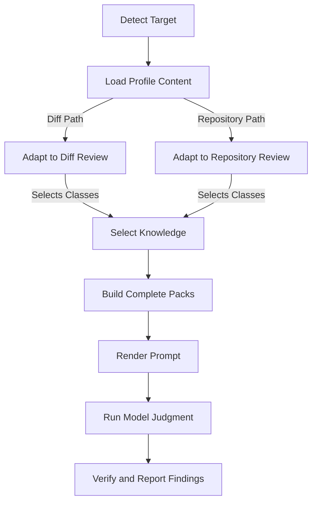

# Knowledge Design

Knowledge Design defines how review knowledge is structured, loaded, selected, and validated.
It covers vulnerability classes, stack guides, protocol guides, detection metadata, review
workflow, and evaluation coverage.

Use the [Knowledge Change Checklist](knowledge-change-checklist.md) to accept a concrete change.
Use [Engine Design](engine-design.md) for shared orchestration, prompt execution, and
completion semantics.

## Design Principles

### Knowledge Is Data

Security knowledge belongs in the selected profile's content tree. The review engine is
generic and should not contain language, framework, protocol, or vulnerability-specific
detection rules. Adding a class or stack should normally be a Markdown or YAML change,
not a Python change.

### Recall Comes First

A selector, packer, deduplicator, or verifier may improve focus, but it must not silently
remove a plausible class or finding. Relevance ordering controls reading order, never
inclusion. A failed or incomplete model or facts step is a failed review step, not a
clean result.

### Findings Need Evidence

Knowledge describes what to investigate. A report still needs a concrete file and line
or symbol, an attacker-controlled input or reachable state, and an exploitable scenario.
Do not turn style advice, dependency CVEs, speculation, or configuration-only concerns
into findings.

### No Benchmark Overfitting

Knowledge changes must improve the general review capability, not encode an answer key.
Do not add a benchmark's finding, sink name, variable name, endpoint, file path, commit
shape, or remediation shape as a special case. Do not write a selection hint whose only
purpose is to activate a class on one known benchmark. A benchmark may expose a missing
general concept, but the resulting guidance must describe that concept in reusable terms.

Do not change an answer key, scorer, benchmark expectation, or gate merely to make a
knowledge change pass. Do not use benchmark-specific examples in the knowledge body when
they reveal the planted issue. Keep benchmark target code and proprietary material out
of the knowledge tree.

Public benchmarks are regression and sanity evidence. They do not prove general recall,
because a model may have seen them. Validate a knowledge change on real targets that did
not define the change, and prefer unseen private targets for the strongest signal. The
baseline and changed arms must differ only in the proposed knowledge change. A gain that
appears only on the originating benchmark is evidence of overfitting, not an accepted
quality improvement.

Apply the integrity checks and record their evidence with the
[Knowledge Change Checklist](knowledge-change-checklist.md).

## Content Layout

Each registered profile shares the knowledge, playbook, and detection content contract.
Profile-specific facts and verification components are optional extensions.

```text
cyberjury/profiles/<profile>/
  knowledge/
    index.md
    vulnerabilities/<id>.md
    guides/
      languages/<language>.md
      frameworks/<language>/<framework>.md
      protocols/<protocol>.md
  playbook/
    methodology.md
    unit-review.md
    severity-rubric.md
    false-positive-traps.md
  detection.yaml
```

The layout resolves through `cyberjury.profiles.base.content_paths` into a `ContentPaths`
record. `cyberjury.profiles.registry` is the only profile registry. `web` is the default profile
and covers Web Application Security. `evm` covers EVM Application Security for Solidity smart
contracts. `--profile auto` uses a simple extension heuristic: a target with Solidity files
selects `evm`, and other targets select `web`. The selected name then resolves through the
registry. Unknown profiles fail loudly.

The package-level constants in `cyberjury.resources` expose the default profile paths. Code
that needs another profile uses `ReviewProfile.paths` instead of importing a second constant set.

The `index.md` file is a human-readable class index. The Markdown loader skips it, so it is not a
vulnerability class and must not be used as one.

## Vulnerability Classes

A vulnerability class lives in `knowledge/vulnerabilities/<id>.md`. The file stem is the
canonical category and must match the frontmatter `id`.

### Frontmatter

```yaml
---
id: sql-injection
title: SQL Injection
impact: CRITICAL
tags: [cwe-89, owasp-a03, injection]
selection_hints: ["cursor.execute", ".raw(", "query +="]
aliases: [sql-injection-variant]
---
```

The fields are ordered and constrained as follows:

| Field | Required | Constraint |
| :--- | :--- | :--- |
| `id` | yes | Matches the lowercase kebab-case file stem and remains stable. |
| `title` | yes | Names the class as it appears in prompts and docs. |
| `impact` | yes | One of `CRITICAL`, `HIGH`, `MEDIUM`, or `LOW`. |
| `tags` | yes | Carry profile taxonomy and stay data-driven. |
| `selection_hints` | yes | Are non-empty and unique after case folding. |
| `aliases` | no | Stay as genuine model-output variants and do not collide with ids or other aliases. |

The body is the complete guidance given to a model. A new or changed class must cover:

- The body covers security condition, attacker control, reachability, and relevant defenses.
- The body distinguishes a real issue from a false positive.
- The body includes a vulnerable and secure pair for each language whose meaning or source
  pattern differs.

A `Not a Finding` section states the safe boundary. The
[review record](knowledge-change-checklist.md#review-output), rather than the model-facing class
body, contains the Language Coverage table for every language guide in the owning profile. A
representative vulnerable and secure pair is enough when the meaning is unchanged across
applicable languages. Unsupported languages should be marked `not applicable` with a technical
reason instead of adding a forced example. Examples should stay general rather than naming a
benchmark target.

Code examples must use languages supported by the owning profile and teach the reusable
property in a minimal, self-contained scenario. Configuration and protocol examples must use
their actual formats. Executable examples should be validated with an available parser,
formatter, compiler, or focused test. An unavailable toolchain is recorded as an unmeasured
gap. The [Knowledge Change Checklist](knowledge-change-checklist.md) contains the acceptance
procedure for these rules.

Selection hints are advisory routing signals, not a vulnerability detector. Prefer
distinctive sinks, APIs, protocol fields, and control-flow markers. Do not use common
syntax or broad words such as `auth`, `public`, `amount`, `status`, or `constructor` as
the only signal. A class with no matching hint can still be reported when the model has
evidence for it.

The web taxonomy requires Common Weakness Enumeration and Open Worldwide Application Security
Project tags. Ethereum Virtual Machine classes use Smart Contract Weakness Classification tags
where a suitable SWC exists. Profile tests cover classes without a suitable SWC. Keep taxonomy
decisions in Markdown metadata, not in Python.

## Language, Framework, and Protocol Guides

Guides live under one of the three guide directories and share a typed frontmatter contract.
The body explains where input enters, how trust and authorization are expressed, important
sinks, and stack-specific failure modes.

```yaml
---
id: django
title: Django
kind: framework
language: python
detect:
  files: ["manage.py", "**/urls.py"]
  manifest_hints: ["django"]
  imports: ["django."]
  content: []
entrypoint_files: ["**/views.py"]
entrypoint_markers: ["path("]
logic_layer_files: ["**/services.py"]
public_api_patterns: []
---
```

The fields are ordered and constrained as follows:

| Field | Required | Constraint |
| :--- | :--- | :--- |
| `id` | yes | Matches the file stem and is unique within the profile. |
| `title` | yes | Names the guide as it appears in stack notes. |
| `kind` | yes | Is `language`, `framework`, or `protocol`. |
| `language` | frameworks only | Names the parent language guide. |
| `detect` | yes | Is a map whose values are string lists for file globs, manifest hints, imports, and content tokens. |
| `entrypoint_files` | yes | Is a string list of likely application entrypoints. |
| `entrypoint_markers` | yes | Is a string list of source markers that seed entrypoints. |
| `logic_layer_files` | yes | Is a string list of downstream business logic files. |
| `public_api_patterns` | yes | Contains multiline regular expressions. |

An empty list is valid for a field with no signal. Generic routing belongs to language
guides. Framework guides declare only framework-specific additions and inherit the parent
language's entrypoint, marker, logic-layer, and public API routing at load time. Protocol
guides are language neutral and primarily contribute detection and review guidance.

Guide selection is deterministic and data-driven:

1. File globs are matched against target paths.
2. Manifest hints are matched only against dependency manifest text.
3. Import markers and content tokens are matched against source or diff text.
4. Matching guides are returned in the language, framework, and protocol pool order.

An ordinary source word must not activate a framework through a manifest-only hint. Routing
tests belong in the [Knowledge Change Checklist](knowledge-change-checklist.md) when a detection
signal changes.

## Detection Configuration

The profile `detection.yaml` file is classification metadata, not vulnerability knowledge.

| Field | Required | Constraint |
| :--- | :--- | :--- |
| `skip_dirs` | yes | Is a string list of directories to skip. |
| `skip_root_dirs` | no | Is a string list of root directories to skip when present. |
| `source_extensions` | yes | Is a string list of source file extensions. |
| `config_extensions` | yes | Is a string list of configuration file extensions. |
| `manifests` | yes | Is a string list of manifest file names. |
| `compile_roots` | no | Is a string list of files that let a facts backend compile a target. |
| `test_dirs` | yes | Is a string list of test directories. |
| `test_name_patterns` | yes | Is a string list of test name patterns. |
| `doc_extensions` | yes | Is a string list of documentation file extensions. |
| `lockfiles` | yes | Is a string list of lockfiles. |

Repository modeling consumes this data to build a deterministic file map. New extensions or conventions belong here rather than in stack-specific branches.

## Playbooks and Review Workspace

Playbook files are operational review knowledge. They define methodology, unit review
instructions, severity grading, and false-positive traps. They are selected from the profile
like vulnerability and guide content, but they do not define finding categories.

Repository Review copies selected material into a private workspace. That workspace stores the
review state and reports:

- Core review files: `_stack.md`, `_vulnerabilities.md`, `methodology.md`, and
  `_false_positive_traps.md`
- Inventory files: `inventory/_auth_model.md` and `inventory/_severity.md`
- Workspace directories: `inventory/`, `units/`, `candidates/`, `findings/`, and `pocs/`
- Run records: `findings.json`, `_run.json`, `_finalize.json`, `_union.json`, `_verified.json`,
  and `_timeline.json`
- Refutation files: `_refuted.md` and `_pocs.md`
- Marker files: `.cyberjury/workspace.json`
- Optional facts artifacts: `_facts.md`, `_facts_by_file.json`, `_facts_units.json`,
  `_facts_graph.json`, `_facts_manifest.json`, `_facts_error.txt`, and `_target.md`

The `playbook/methodology.md` file maps to `methodology.md`. The `playbook/false-positive-traps.md` file maps to `_false_positive_traps.md`. These are review inputs and provenance, not substitutes for source Markdown under version control. `_run.json` and `_finalize.json` are completion and comparison records, not debug output.

## Runtime Knowledge Flow

Knowledge loading is shared. Each review path then adapts its target input before selecting and
packing knowledge for prompt construction. The diagram summarizes the shared flow. The sections
below define the path-specific rules.



The two review paths use the same vulnerability catalog and selection semantics.

### Diff Review

The diff adapter selects guides from changed paths and diff text. For each judgment unit,
vulnerability classes come from the patch plus grounded repository context when available.
Matched classes are ranked by impact, the longest matching hint, number of hints, and stable id.
The selector keeps every match.

### Repository Review

Scaffolding selects guides from the repository file list, manifests, and source sample. It writes
the complete rendered vulnerability library to `_vulnerabilities.md` and the selected stack
guidance to `_stack.md`. Each review unit then selects vulnerability knowledge from its own source
and extracted facts. The same unit evidence is reused for each knowledge pack, so a pack boundary
cannot change the selection evidence.

### Bounded Knowledge Packs

The `VulnerabilityCatalog.plan` method partitions selected classes without truncating any class.
A class larger than the configured pack limit remains intact in its own pack. If nothing matches,
one pack with the display label `general review` is still emitted. The label is not a category id.
A pack owns only its assigned classes, while a reviewer may report a compelling class that the
selector did not choose.

The rendered Markdown body is sent as prompt knowledge. The engine owns packing, parallel
execution, failure accounting, monotonic accumulation, and verification. The profile content
owns the security explanation.

### Categories and Aliases

Diff Review prompts expose the loaded vulnerability ids and allow `other` when none fit.
Repository Review prompts expose the loaded ids, then canonicalize known aliases while keeping
unknown labels distinct during candidate identity so unrelated classes are not merged. Model
labels are normalized to lowercase hyphenated ids before these path-specific rules apply.

## Adding or Changing Knowledge

The [Knowledge Change Checklist](knowledge-change-checklist.md) covers the change type,
required checks, validation, and acceptance decision. The checklist owns execution details.
The two arm evaluation procedure for behavior changes lives in
`evals/docs/detection-quality-backtest.md`, relative to the code repository root.
