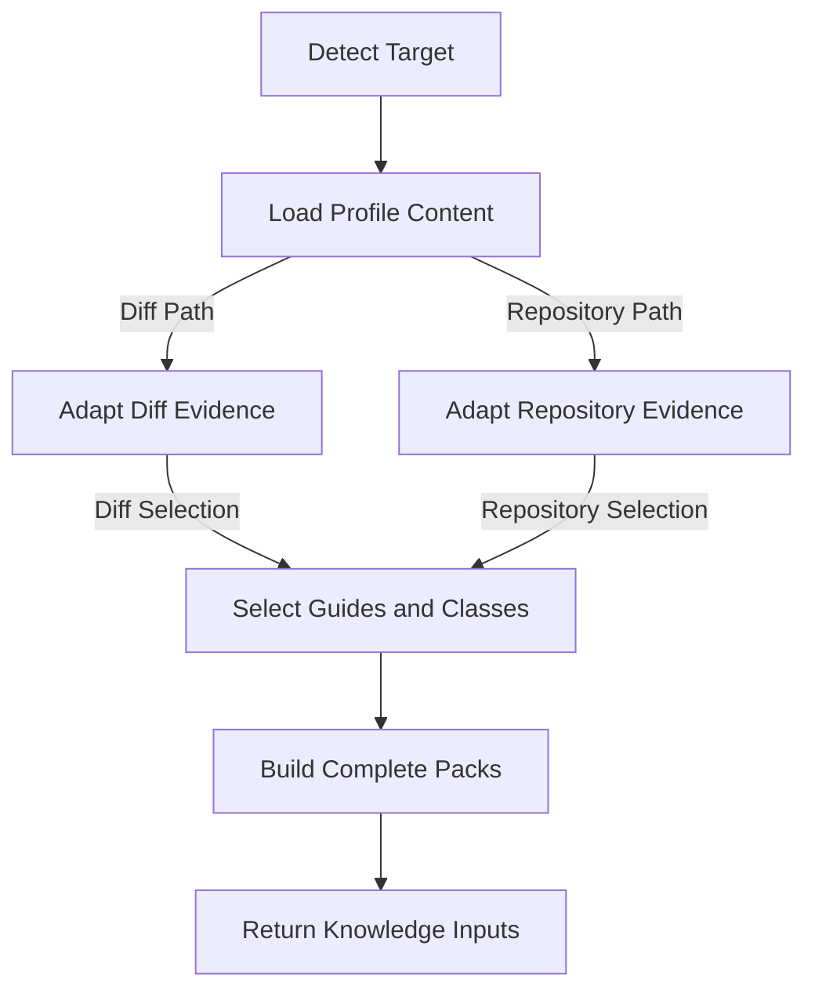

# Knowledge Design

Knowledge Design defines the profile content model and the knowledge inputs supplied to the
review engine. It covers vulnerability classes, guides, playbooks, detection metadata, selection,
packing, and category normalization.

Use the [Knowledge Change Checklist](knowledge-change-checklist.md) to accept a concrete change.
Use [Engine Design](engine-design.md) for shared orchestration, prompt execution, and
completion semantics.

## Design Principles

### Knowledge Is Data

Security knowledge belongs in the selected profile's content tree. The review engine is
generic and should not contain language, framework, protocol, or vulnerability-specific
detection rules. Adding a class or stack should normally be a Markdown or YAML change,
not a Python change.

### Recall Comes First

A selector or packer may improve focus, but it must not silently remove a matching class or part
of a class body. Relevance ordering controls reading order, never inclusion. Engine failure and
finding retention semantics live in [Engine Design](engine-design.md#core-invariants).

### Findings Need Evidence

Knowledge describes what to investigate. A report still needs a concrete file and line
or symbol, an attacker-controlled input or reachable state, and an exploitable scenario.
Do not turn style advice, dependency CVEs, speculation, or configuration-only concerns
into findings.

### No Benchmark Overfitting

Knowledge changes must improve the general review capability, not encode an answer key.
Do not add a benchmark's finding, sink name, variable name, endpoint, file path, commit
shape, or remediation shape as a special case. Do not write a selection hint whose only
purpose is to activate a class on one known benchmark. A benchmark may expose a missing
general concept, but the resulting guidance must describe that concept in reusable terms.

Do not change an answer key, scorer, benchmark expectation, or gate merely to make a
knowledge change pass. Do not use benchmark-specific examples in the knowledge body when
they reveal the planted issue. Keep benchmark target code and proprietary material out
of the knowledge tree.

Public benchmarks are regression and sanity evidence. They do not prove general recall because a
model may have seen them. A target that informed the change can confirm a regression but cannot
prove improvement. Acceptance requires evidence from an independent real target under the
[Knowledge Change Checklist](knowledge-change-checklist.md). The backtest runbook owns the exact
comparison controls.

Apply the integrity checks and record their evidence with the
[Knowledge Change Checklist](knowledge-change-checklist.md).

## Directory Layout

Each registered profile shares the knowledge, playbook, and detection content contract. A profile
may also bind facts and proof of concept backends. Those engine extensions are not knowledge
content and follow [Engine Design](engine-design.md#facts-and-grounding).

```text
cyberjury/profiles/<profile>/
  knowledge/
    index.md
    vulnerabilities/<id>.md
    guides/
      languages/<language>.md
      frameworks/<language>/<framework>.md
      protocols/<protocol>.md
  playbook/
    methodology.md
    unit-review.md
    severity-rubric.md
    false-positive-traps.md
  detection.yaml
```

The layout resolves through `cyberjury.profiles.base.content_paths` into a `ContentPaths`
record. `cyberjury.profiles.registry` is the only profile registry. `web` is the default profile
and covers Web Application Security. `evm` covers EVM Application Security for Solidity smart
contracts. `--profile auto` uses a simple extension heuristic: a target with Solidity files
selects `evm`, and other targets select `web`. The selected name then resolves through the
registry. Unknown profiles fail loudly.

The package-level constants in `cyberjury.resources` expose the default profile paths. Code
that needs another profile uses `ReviewProfile.paths` instead of importing a second constant set.

The `index.md` file is a human-readable class index. The Markdown loader skips it, so it is not a
vulnerability class and must not be used as one.

## Vulnerability Classes

A vulnerability class lives in `knowledge/vulnerabilities/<id>.md`. The file stem is the
canonical category and must match the frontmatter `id`.

### Frontmatter

```yaml
---
id: sql-injection
title: SQL Injection
impact: CRITICAL
tags: [cwe-89, owasp-a03, injection]
selection_hints: ["cursor.execute", ".raw(", "query +="]
aliases: [sql-injection-variant]
---
```

The fields are ordered and constrained as follows:

| Field | Required | Constraint |
| :--- | :--- | :--- |
| `id` | yes | Matches the lowercase kebab-case file stem and remains stable. |
| `title` | yes | Names the class as it appears in prompts and docs. |
| `impact` | yes | One of `CRITICAL`, `HIGH`, `MEDIUM`, or `LOW`. |
| `tags` | yes | Carry profile taxonomy and stay data-driven. |
| `selection_hints` | yes | Are non-empty and unique after case folding. |
| `aliases` | no | Stay as genuine model-output variants and do not collide with ids or other aliases. |

The body is the complete guidance given to a model. Its top level structure is fixed so every class
presents the same information roles while leaving security behavior detail flexible.

### Body Structure

Every vulnerability class uses this exact H2 order:

1. `Security Condition`
2. `Review Guidance`
3. `Examples`
4. `Not a Finding`

The H1 equals the frontmatter `title`. Body prose begins under `Security Condition` rather than in an
unnamed introduction between the H1 and first H2. No other H2 is allowed.

`Security Condition` defines the positive vulnerability predicate. It names attacker controlled
input, identity, state, or timing, the reachable dangerous operation or transition, the failed
security property, and the concrete outcome. A class with several security behaviors names each one
without turning language names into the primary organization axis.

`Review Guidance` tells the reviewer what to trace, where the reportable operation or construction
lives, which off-file controls must be read, and what evidence establishes a concrete exploit. It
names controls to inspect without assuming an unseen control exists.

`Examples` contains concrete vulnerable and secure contrasts. Security behaviors or evidence
patterns use H3 headings. A language, framework, or format may qualify an H3 when it changes the
review rule, but it is not an H2. Detailed H3 sections may also appear under another required H2
when they improve that section. Do not repeat the same H3 set across sections merely to make the
outline symmetrical.

`Not a Finding` appears exactly once as the final H2. It states the confirmed facts that negate the
positive predicate and distinguishes a real control from a weak lookalike.

A class may contain several security behaviors when they share one positive predicate, report
category, and safe boundary. Split security behaviors that need unrelated vulnerability conditions
or controls. Do not use a numeric behavior limit as a substitute for that judgment.

### Example Policy

Every vulnerability class has at least one concrete vulnerable and secure pair. Add another pair
only when a reviewer must make a different security decision because at least one of these changes:

- the dangerous operation or state transition
- the controlling safety fact
- runtime or API behavior
- the evidence path or reportable location

A different language, library wrapper, spelling, attacker outcome, or benchmark target does not by
itself justify another pair. One representative pair may cover several languages when the security
condition, runtime behavior, and controlling fact are equivalent.

The vulnerable and secure variants preserve the same input boundary, operation, state, and context
where practical. The vulnerable variant shows attacker control, the dangerous operation, and the
missing control. The secure variant changes the smallest fact that fixes the root cause.

Use separate `Vulnerable:` and `Secure:` fences with the same language tag by default. A single
paired fence is allowed when shared declarations, interfaces, state, or protocol context would make
separate fences repetitive or incomplete. Combined examples use explicit names such as
`VulnerableVault` and `SecureVault`. This form is especially useful for Solidity.

Choose the language or format whose semantics establish the security rule:

1. EVM behavior uses Solidity.
2. Browser, Node.js, object model, and prototype behavior uses JavaScript. Use TypeScript only when
   types, decorators, framework metadata, or emitted JavaScript changes the review rule.
3. Go is used only when its standard library, concurrency model, or runtime behavior changes the
   review rule.
4. A framework example uses its native language only when the framework changes the evidence or
   controlling fact.
5. A language neutral Web backend example uses the shortest faithful form. Python is the tie
   breaker when no language is more natural.

Do not create Python, JavaScript, TypeScript, and Go copies to satisfy a language quota. Source code
uses a language supported by the profile. Configuration, request, response, and protocol examples
use their real format when code would hide the reviewed boundary.

Examples stay minimal, English, and independent of benchmark targets. Include the least context
needed to establish attacker control, exploit conditions, the dangerous operation, and the
controlling safety facts. Actors, state, timing, and bindings belong when the behavior depends on
them. Do not hide security relevant logic with ellipses or explanatory comments. Production
scaffolding, reusable utilities, and exhaustive error handling belong in tests or the review record.

Validate every new or materially changed executable example with an available parser, formatter,
compiler, or focused test. Changing only an example's position in the body does not require
revalidating identical executable content. Record an unavailable toolchain as an unmeasured gap. The
[Knowledge Change Checklist](knowledge-change-checklist.md) contains the acceptance procedure.

### Selection Policy

Selection hints are advisory routing signals, not a vulnerability detector. Prefer
distinctive sinks, APIs, protocol fields, and control-flow markers. Do not use common
syntax or broad words such as `auth`, `public`, `amount`, `status`, or `constructor` as
the only signal. A class with no matching hint can still be reported when the model has
evidence for it.

Each materially different dangerous operation should use a hint when it has a stable low noise
API, syntax form, annotation, or protocol token. This does not require one hint for every spelling
or example. When no narrow signal exists, rely on the reviewer route that permits an unselected
class and measure that risk in the required backtest instead of adding a broad hint. Every new hint
family needs representative positive and negative routing coverage.

### Taxonomy

The web taxonomy requires Common Weakness Enumeration and Open Worldwide Application Security
Project tags. Ethereum Virtual Machine classes use Smart Contract Weakness Classification tags
where a suitable SWC exists. Profile tests cover classes without a suitable SWC. Keep taxonomy
decisions in Markdown metadata, not in Python.

## Language, Framework, and Protocol Guides

Guides live under one of the three guide directories and share a typed frontmatter contract.
The body explains where input enters, how trust and authorization are expressed, important
sinks, and stack-specific failure modes.

### Frontmatter

```yaml
---
id: django
title: Django
kind: framework
language: python
detect:
  files: ["manage.py", "**/urls.py"]
  manifest_hints: ["django"]
  imports: ["django."]
  content: []
entrypoint_globs: ["**/views.py"]
entrypoint_markers: ["path("]
logic_layer_globs: ["**/services.py"]
---
```

The fields are ordered and constrained as follows:

| Field | Required | Constraint |
| :--- | :--- | :--- |
| `id` | yes | Matches the file stem and is unique within the profile. |
| `title` | yes | Names the guide as it appears in stack notes. |
| `kind` | yes | Is `language`, `framework`, or `protocol`. |
| `language` | frameworks only | Names the parent language guide. |
| `detect` | yes | Is a map whose values are string lists for file globs, manifest hints, imports, and content tokens. |
| `entrypoint_globs` | no | Contains globs for likely application entrypoints. |
| `entrypoint_markers` | no | Contains source markers that seed entrypoints. |
| `logic_layer_globs` | no | Contains globs for downstream business logic files. |
| `exported_symbol_patterns` | languages only | Contains multiline regular expressions for language exported symbols. |

### Body Structure

Every guide uses one H1 equal to `<title> Review Notes` and this exact H2 order:

1. `Attack Surface`
2. `Trust Boundaries`
3. `Review Guidance`
4. `Safe Boundaries`

Body prose begins under `Attack Surface`, and no other H2 is allowed. Entrypoint, lifecycle,
authorization, sink, API, and protocol topics belong under H3 sections in the appropriate H2. A
guide does not repeat a complete vulnerability contract.

`Attack Surface` identifies stack specific entrypoints, externally influenced state, assets, and
important execution paths. `Trust Boundaries` explains how the stack represents identity,
authority, tenancy, isolation, and lifecycle bindings. `Review Guidance` names the APIs,
transitions, defaults, and failure modes that require inspection. `Safe Boundaries` states the
stack controls that prevent a reportable issue.

Every required section contains stack specific information. A language guide may state that the
language provides no application authorization boundary and direct the reviewer to framework and
application controls. Empty sections and generic filler are not acceptable.

Guides do not require examples. Add one only when a stack specific API, default, configuration, or
control cannot be explained precisely with a short rule and inline identifiers. Place it under an
H3 in `Review Guidance`. It teaches stack behavior rather than redefining a vulnerability class and
uses the same minimal style and validation rules as vulnerability examples.

### Routing and Selection

An absent routing field contributes no signal. Generic routing belongs to language guides.
Framework guides declare only framework-specific additions and inherit the parent language's
entrypoint, marker, logic layer, and exported symbol routing at load time. Only language guides
declare `exported_symbol_patterns`. Protocol guides are language neutral and primarily contribute
detection and review guidance.

Guide selection is deterministic and data-driven:

1. File globs are matched against target paths.
2. Manifest hints are matched only against dependency manifest text.
3. Import markers and content tokens are matched against source or diff text.
4. Matching guides are returned in the language, framework, and protocol pool order.

An ordinary source word must not activate a framework through a manifest-only hint. Routing
tests belong in the [Knowledge Change Checklist](knowledge-change-checklist.md) when a detection
signal changes.

## Detection Configuration

The profile `detection.yaml` file is classification metadata, not vulnerability knowledge.

| Field | Required | Constraint |
| :--- | :--- | :--- |
| `skip_dirs` | yes | Is a string list of directories to skip. |
| `skip_root_dirs` | no | Is a string list of root directories to skip when present. |
| `source_extensions` | yes | Is a string list of source file extensions. |
| `config_extensions` | yes | Is a string list of configuration file extensions. |
| `manifests` | yes | Is a string list of manifest file names. |
| `compile_roots` | no | Is a string list of files that let a facts backend compile a target. |
| `test_dirs` | yes | Is a string list of test directories. |
| `test_name_patterns` | yes | Is a string list of test name patterns. |
| `doc_extensions` | yes | Is a string list of documentation file extensions. |
| `lockfiles` | yes | Is a string list of lockfiles. |

Repository modeling consumes this data to build a deterministic file map. New extensions or
conventions belong here rather than in stack-specific branches.

## Playbooks

Playbook files are operational review knowledge. They define methodology, unit review
instructions, severity grading, and false-positive traps. They are selected from the profile
like vulnerability and guide content, but they do not define finding categories.

Repository Review materializes selected playbooks as model and operator inputs. The
`playbook/methodology.md` file maps to `methodology.md`, and
`playbook/false-positive-traps.md` maps to `_false_positive_traps.md`. The source Markdown under
the profile remains authoritative. Workspace lifecycle, state, and artifact ownership live in
[Repository Review Workflow](engine-design.md#repository-review-workflow).

## Runtime Knowledge Flow

Knowledge loading is shared. Each review path adapts its evidence before selecting guides and
vulnerability classes. This document owns the flow through complete knowledge inputs. Engine
prompt construction starts after this boundary.



The engine consumes these inputs through
[Prompt Construction](engine-design.md#prompt-construction). The two review paths use the same
vulnerability catalog and selection semantics.

### Diff Review

The diff adapter selects guides from changed paths and diff text. For each judgment unit,
vulnerability classes come from the patch plus grounded repository context when available.
Matched classes are ranked by impact, the longest matching hint, number of hints, and stable id.
The selector keeps every match.

### Repository Review

Scaffolding selects guides from the repository file list, manifests, and source sample. Each review
unit selects vulnerability classes once from its own source and extracted facts before the
catalog builds its pack plan.

### Bounded Knowledge Packs

The `VulnerabilityCatalog.plan` method partitions selected classes without truncating any class.
A class larger than the configured pack limit remains intact in its own pack. If nothing matches,
one pack with the display label `general review` is still emitted. The label is not a category id.
A pack owns only its assigned classes, while a reviewer may report a compelling class that the
selector did not choose.

The packing target is not a content budget. Do not remove a security behavior, attacker condition,
safe boundary, or required example merely to keep two classes in one judgment. Complete knowledge
may occupy its own pack, and the resulting cost is measured in the required backtest. Completeness
does not justify repeated equivalent examples or production-sized sample implementations.

The catalog owns selection and the complete pack plan. The engine consumes that plan and owns
parallel execution, failure accounting, accumulation, and verification. Profile content owns the
security explanation.

### Categories and Aliases

Diff Review prompts expose the loaded vulnerability ids and allow `other` when none fit.
Repository Review prompts expose the loaded ids, then canonicalize known aliases while keeping
unknown labels distinct during candidate identity so unrelated classes are not merged. Model
labels are normalized to lowercase hyphenated ids before these path-specific rules apply.
