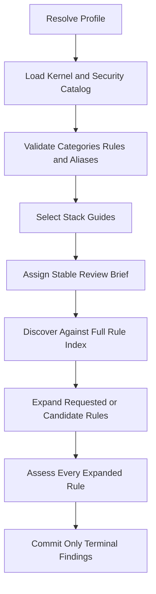

# Knowledge Design

Knowledge Design defines the profile content supplied to the review engine. It covers the security
reasoning kernel, the canonical security catalog, stack guides, playbooks, and detection metadata.

Use the [Knowledge Change Checklist](knowledge-change-checklist.md) to accept a concrete change.
Use [Engine Design](engine-design.md) for orchestration, model calls, and completion semantics.

## Design Principles

### One Owner for Each Fact

Each security fact has one runtime owner.

- `security-kernel.md` owns the profile wide reasoning method.
- `security-catalog.yaml` owns public categories, aliases, taxonomy tags, and behavior rules.
- Guides own language, framework, and protocol semantics.
- `detection.yaml` owns deterministic file and stack classification signals.
- Playbooks own operational review instructions.

The engine is generic. It validates and transports this data but does not hardcode a stack or
vulnerability detector.

### Recall Comes First

Every judgment unit receives the full behavior rule index for its profile. Source text never
removes a category or behavior from consideration. Full rule details are delivered on demand. A
new candidate also expands its named rule automatically. The role must assess every expanded rule
before its candidate can become a final finding. This guarantees stable rule visibility and no
deterministic filtering. It does not prove that a model reasoned about every visible rule.

### Findings Need Evidence

Knowledge describes what to investigate. A report still needs a concrete location, a reachable
attacker path, the failed security property, and an exploitable outcome. Style advice, dependency
vulnerabilities, speculation, and configuration only concerns are not findings.

### No Benchmark Overfitting

Knowledge changes improve the general review capability. They do not encode an answer key, target
path, endpoint, variable, sink spelling, or planted fix shape. A motivating target can expose a
missing general rule, but it cannot prove the change. Acceptance follows the independent target and
two arm requirements in the [Knowledge Change Checklist](knowledge-change-checklist.md).

## Directory Layout

```text
cyberjury/profiles/<profile>/
  knowledge/
    security-kernel.md
    security-catalog.yaml
    guides/
      languages/<language>.md
      frameworks/<language>/<framework>.md
      protocols/<protocol>.md
  playbook/
    methodology.md
    unit-review.md
    severity-rubric.md
    false-positive-traps.md
  detection.yaml
```

The layout resolves through `cyberjury.profiles.base.content_paths`. The profile registry lives in
`cyberjury.profiles.registry`. The `web` profile is the default. The `evm` profile covers Solidity
contracts. Unknown profiles fail loudly.

## Security Kernel

The kernel defines the common reasoning procedure. It directs a role to trace actors, authority,
attacker controlled input, state transitions, dangerous operations, controlling facts, and concrete
harm. It remains compact and contains no stack detector, target identifier, or behavior catalog.

The kernel is always present in a judgment prompt. Its content hash is part of the knowledge
assignment receipt.

## Security Catalog

`security-catalog.yaml` is the single runtime source for security categories and decision rules. Its
top level form is strict.

```yaml
schema: 1
categories:
  sql-injection:
    title: SQL Injection
    aliases: [sql_injection]
    tags: [cwe-89, owasp-a03, injection]
rules:
  - id: sql-syntax-boundary
    category_id: sql-injection
    title: Untrusted Input Changes SQL Syntax
    security_property: Untrusted values must remain data rather than SQL syntax.
    required_evidence: A reachable input changes the parsed query structure.
    refuting_evidence: Parameter binding keeps the value outside SQL syntax.
    report_boundary: Report the query construction or execution boundary.
```

### Categories

Each category map entry has these exact fields.

| Field | Meaning |
| :--- | :--- |
| map key | Stable lowercase category id used in findings. |
| `title` | Human readable category name. |
| `aliases` | Accepted model output variants owned by this category. |
| `tags` | External taxonomy and grouping metadata. |

Aliases cannot collide with category ids or aliases owned by another category. Severity does not
belong in the category because severity depends on the concrete exploit and impact.

### Decision Rules

Each rule has these exact fields.

| Field | Meaning |
| :--- | :--- |
| `id` | Stable behavior identity cited by a candidate. |
| `category_id` | Canonical category that owns the behavior. |
| `title` | Short behavior name. |
| `security_property` | Invariant shown in the discovery index. |
| `required_evidence` | Positive facts needed for a reportable exploit. |
| `refuting_evidence` | Controlling facts that make the path safe. |
| `report_boundary` | Source operation or transition that owns the location. |

Every category owns at least one rule. Every rule uses a known category. Rule ids and category ids
have stable sorted rendering. The loader rejects unknown fields so an accidental schema change
cannot silently alter prompts.

### Runtime Rule Protocol

Initial discovery receives the kernel and every rule id, category id, and security property. This
preserves complete rule visibility while avoiding repeated full rule bodies.

A role can request a rule id or category id. Code expands category requests in stable catalog order.
A candidate must name one primary rule that belongs to its category. A candidate in category
`other` is the only exception.

A new candidate whose rule details are not visible becomes provisional. The engine retains and
redisplays it, delivers the full rule, and requires another response. A terminal `finding`
assessment preserves matching provisional candidates. A `not_exploitable` assessment removes them
after the model supplies a nonempty reason and evidence references. Code validates that structure,
but the reason's semantic correctness remains model judgment. Unknown rules, category mismatches,
duplicate assessments, and incomplete assessments fail the role.

The first call receives the complete behavior index. Follow-up calls receive the complete category
index and the full details of already expanded rules. This retains profile coverage without
repeating unrelated behavior properties on every evidence exchange.

This protocol does not make model judgment mathematically deterministic. It does make the input,
allowed identities, required evidence contract, and completion condition stable and auditable.

## Stack Guides

Guides cover language, framework, and protocol semantics. They explain attack surfaces, trust
boundaries, important APIs, lifecycle rules, and confirmed safe boundaries. A guide does not define
a finding category or copy a complete decision rule.

### Frontmatter

```yaml
---
id: django
title: Django
kind: framework
language: python
detect:
  files: [manage.py, "**/urls.py"]
  manifest_hints: [django]
  imports: [django.]
  content: []
entrypoint_globs: ["**/views.py"]
entrypoint_markers: ["path("]
logic_layer_globs: ["**/services.py"]
---
```

| Field | Required | Constraint |
| :--- | :--- | :--- |
| `id` | yes | Matches the file stem and is unique in the profile. |
| `title` | yes | Names the guide in stack notes. |
| `kind` | yes | Is `language`, `framework`, or `protocol`. |
| `language` | framework only | Names an existing parent language guide. |
| `detect` | yes | Contains string lists for files, manifests, imports, and content. |
| `entrypoint_globs` | no | Names likely application entrypoint paths. |
| `entrypoint_markers` | no | Names source markers that seed entrypoints. |
| `logic_layer_globs` | no | Names downstream application logic paths. |
| `exported_symbol_patterns` | language only | Names exported symbol forms as regular expressions. |

### Body Contract

Every guide uses one H1 equal to `<title> Review Notes` and this exact H2 order.

1. `Attack Surface`
2. `Trust Boundaries`
3. `Review Guidance`
4. `Safe Boundaries`

Each section contains stack specific information. Examples are optional and teach stack behavior,
not a vulnerability contract.

### Routing

File globs match target paths. Manifest hints match dependency manifests only. Import markers and
content tokens match source or diff text. Framework guides inherit generic routing from their parent
language. Selection order is stable and data driven.

Guides may help locate and interpret evidence. They never remove security rules from the discovery
index.

### External API Facts

Version specific third party API behavior is not an ordinary stack guide. A future implementation
must acquire it through a separate grounding provider with source provenance, version applicability,
and explicit failure semantics. Until that provider exists, the engine must not claim that a small
handwritten library guide is complete external API grounding.

## Detection Configuration

The profile `detection.yaml` file owns deterministic classification metadata.

| Field | Required | Constraint |
| :--- | :--- | :--- |
| `skip_dirs` | yes | Directories excluded from traversal. |
| `skip_root_dirs` | no | Root directories excluded when present. |
| `source_extensions` | yes | Source file extensions. |
| `config_extensions` | yes | Security relevant configuration extensions. |
| `manifests` | yes | Dependency manifest names. |
| `compile_roots` | no | Files required by a facts backend to compile the target. |
| `test_dirs` | yes | Test directory names. |
| `test_name_patterns` | yes | Test file name patterns. |
| `doc_extensions` | yes | Documentation extensions. |
| `lockfiles` | yes | Dependency lockfile names. |

Repository modeling consumes this data to build a deterministic file map. New conventions belong in
profile data rather than Python branches.

## Playbooks

Playbooks define operational methodology, unit review instructions, severity grading, and common
false positive traps. They may reference catalog ids but cannot define another category or behavior
contract.

## Runtime Flow

Both review paths use the same knowledge flow.



Diff Review and Repository Review differ only in how they adapt source evidence and unit boundaries.
They share `ReviewBrief`, category canonicalization, rule expansion, response validation, and final
finding semantics.

`knowledge.json` records the profile, grounding receipt, unit order, category ids, rule ids, kernel
hash, discovery brief hash, and full security catalog hash. This makes the exact knowledge input
observable without duplicating its full text in every call record.
